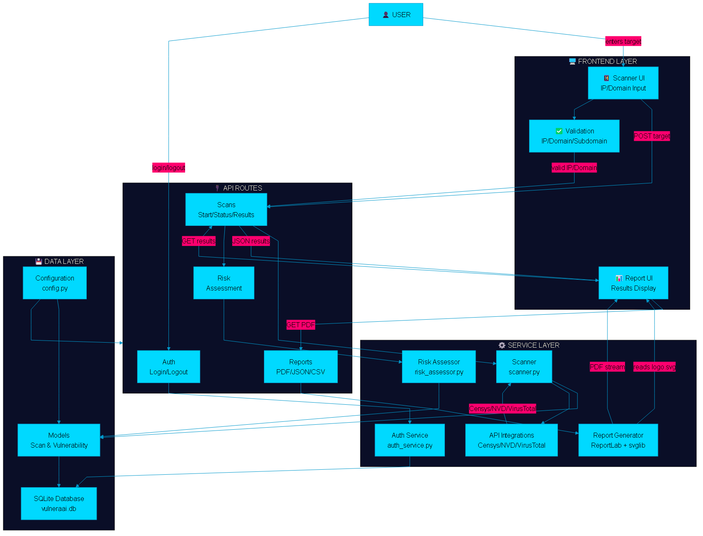

# VulneraAI - AI-Powered Vulnerability Scanner

A modern vulnerability scanning platform with AI-powered risk assessment, **external API integrations** (Censys, NVD, VirusTotal), and downloadable reports. Built with **HTML5, CSS3, JavaScript** frontend and **Python Flask** backend.

## 🎯 Features

- **🔍 IP & Domain Scanning** - Scan IPv4, IPv6, and domain names for vulnerabilities
- **🌐 External API Integration** - Enhanced scanning with Censys, NVD, and VirusTotal
- **🤖 AI-Powered Risk Scoring** - Machine learning-based risk assessment (0-100)
- **🛡️ CVE Database Integration** - Official vulnerability data from NVD
- **🔒 Threat Intelligence** - Real-time malware and reputation checks via VirusTotal
- **📊 Detailed Reports** - Download reports in PDF, JSON, or CSV format
- **🎨 Modern Dark UI** - Cybersecurity-themed design with glass morphism effects
- **⚡ Real-time Progress** - Live scanning updates with time estimation
- **💾 Scan History** - Store and review previous scans locally
- **📱 Responsive Design** - Works on desktop, tablet, and mobile devices
- **🔐 Secure & Private** - API keys stored securely in environment variables

## 🌟 New: External API Integrations

VulneraAI now integrates with industry-leading security APIs:

### 🔭 Censys
- Internet-wide scanning data
- Service version detection
- SSL/TLS certificate analysis
- Weak configuration detection

### 📚 NVD (National Vulnerability Database)
- Official CVE identifiers
- CVSS vulnerability scores
- Detailed descriptions
- Patch recommendations

### 🛡️ VirusTotal
- Malware detection across 70+ vendors
- IP/Domain reputation scores
- Threat intelligence
- Historical attack data

**See [API_SETUP_GUIDE.md](API_SETUP_GUIDE.md) for setup instructions!**

## 🛠️ Tech Stack

### Frontend
- **HTML5** - Semantic markup
- **CSS3** - Modern styling with variables, animations, and glass morphism
- **JavaScript (Vanilla)** - No frameworks, lightweight and fast
- **LocalStorage API** - Client-side data persistence

### Backend
- **Python 3.8+** - Server runtime
- **Flask** - Lightweight web framework
- **Flask-CORS** - Cross-origin resource sharing
- **SQLite** - Lightweight database
- **Threading** - Background task execution

## 📦 Project Structure

```
vulneraai/
├── frontend/                 # HTML, CSS, JS frontend
│   ├── index.html           # Main page
│   ├── css/
│   │   └── styles.css       # Dark theme with glass morphism
│   ├── js/
│   │   ├── script.js        # Main application logic
│   │   ├── api.js           # API communication
│   │   └── utils.js         # Utility functions
│   └── assets/              # Images and icons
│
├── backend/                  # Python Flask backend
│   ├── app.py               # Flask application
│   ├── config.py            # Configuration
│   ├── requirements.txt      # Python dependencies
│   ├── models/
│   │   └── scan_model.py     # Data models
│   ├── services/
│   │   ├── scanner.py        # Vulnerability scanning
│   │   ├── risk_assessor.py  # AI risk assessment
│   │   └── report_generator.py  # Report generation
│   ├── routes/              # API routes
│   └── data/                # SQLite database
│
├── SETUP.md                 # Detailed setup guide
├── start.bat                # Windows startup script
├── start.sh                 # Linux/Mac startup script
└── README.md
```

## 🧭 Architecture

- **System Architecture:** See [docs/architecture.md](docs/architecture.md) for the Mermaid source.
  

- **Database ERD:** See [docs/erd.mmd](docs/erd.mmd) for the Mermaid source.
  

## 🚀 Quick Start

### Prerequisites
- **Python 3.8+** installed
- **Modern web browser** (Chrome, Firefox, Edge, Safari)

### Windows
```bash
# Run the startup script
start.bat
```

### macOS/Linux
```bash
# Make script executable
chmod +x start.sh

# Run the startup script
./start.sh
```

### Manual Setup
```bash
# 1. Install backend dependencies
cd backend
pip install -r requirements.txt

# 2. Start backend
python app.py

# 3. Open frontend in browser
# Double-click frontend/index.html or open it in browser
```

## 💻 Usage

1. **Enter Target** - IP address or domain name
2. **Select Scan Type** - Quick (5min), Standard (15min), or Comprehensive (30min)
3. **Start Scan** - Click the scan button and watch real-time progress
4. **View Results** - See vulnerabilities, risk score, and recommendations
5. **Download Report** - Export as PDF, JSON, or CSV

## 🔗 API Endpoints

### Scanning
- `POST /api/scans/start` - Start a new vulnerability scan
- `GET /api/scans/<scan_id>/status` - Get current scan progress
- `GET /api/scans/<scan_id>/results` - Get scan results and vulnerabilities
- `POST /api/scans/<scan_id>/cancel` - Cancel a running scan

### Risk Assessment
- `GET /api/risk/<scan_id>` - Get AI-powered risk score

### Reports
- `GET /api/reports/history` - Get scan history
- `POST /api/reports/generate` - Generate downloadable report

## 🎨 UI/UX Features

### Dark Cybersecurity Theme
- Cyan (#00d9ff) primary accent
- Hot pink (#ff006e) secondary accent
- Deep navy (#0a0e27) dark background
- Glass morphism effects with backdrop blur

### Interactive Elements
- Real-time scanning progress bar with timer
- Animated risk score gauge (0-100)
- Color-coded severity indicators
- Responsive grid layouts
- Smooth animations and transitions
- Modal popups for details

## 📊 Risk Levels

| Level | Score | Color | Action |
|-------|-------|-------|--------|
| **CRITICAL** | 80-100 | Red | Immediate action required |
| **HIGH** | 60-79 | Pink | Urgent remediation needed |
| **MEDIUM** | 40-59 | Orange | Plan remediation |
| **LOW** | 20-39 | Green | Monitor and document |
| **MINIMAL** | 0-19 | Blue | Continue monitoring |

## 📚 Documentation

For detailed setup, customization, and troubleshooting, see [SETUP.md](SETUP.md)
```
REACT_APP_API_URL=http://localhost:5000/api
```

## API Endpoints

### Scans
- `POST /api/scans/ip` - Scan IP address
- `POST /api/scans/domain` - Scan domain
- `GET /api/scans/:id` - Get scan details
- `GET /api/scans` - List all scans
- `DELETE /api/scans/:id` - Delete scan

### Reports
- `GET /api/reports/:scanId` - Generate report
- `GET /api/reports/:scanId/download` - Download report as PDF

### Risk Assessment
- `POST /api/risk/assess` - Get AI-powered risk score

## Features in Detail

### Vulnerability Scanning
- Port scanning
- Service detection
- Vulnerability database matching
- Certificate analysis
- DNS records enumeration

### AI Risk Scoring
- Machine learning-based assessment
- Multiple risk factors analysis
- Confidence scoring
- Actionable recommendations

### Report Generation
- Executive summary
- Detailed findings
- Risk heatmap
- Remediation steps
- Comparison metrics

## License

MIT

## Contact

For support and inquiries, contact the VulneraAI team.
