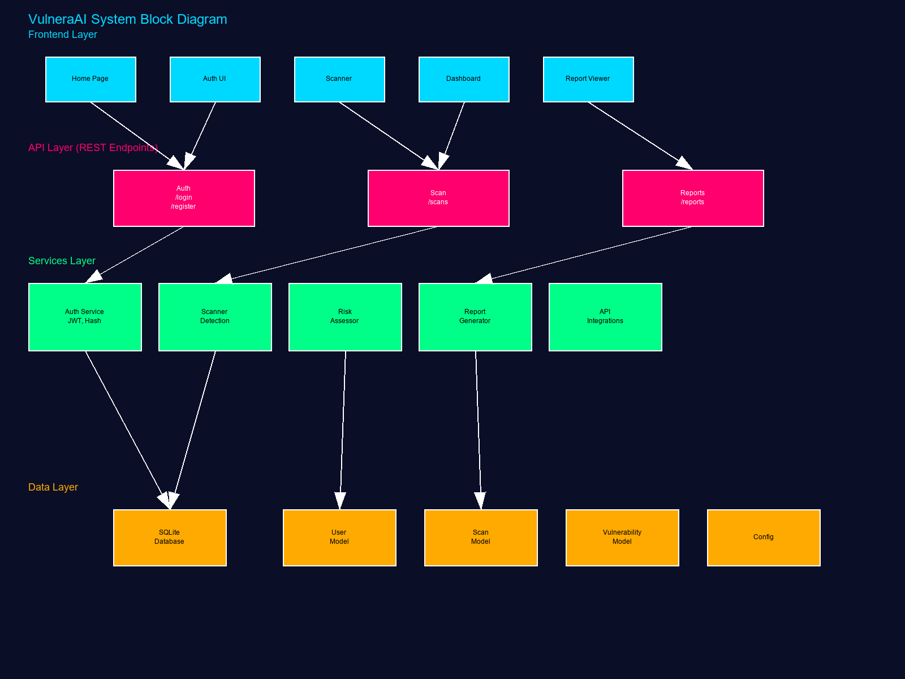

<div align="center">


# VulneraAI — AI‑Powered Vulnerability Scanner 🔎🛡️

[](#)
[](#)
[](#license)
[](#)

</div>

Modern vulnerability scanning with real‑time port analysis, optional threat‑intel enrichment (Censys, NVD, VirusTotal), risk scoring, and downloadable reports. ✨ Frontend in HTML/CSS/JS; backend in Python Flask with SQLite.

## 🎯 Features

- **🔍 IP/Domain scans:** Quick, Standard, or Comprehensive modes
- **🧠 Threat‑intel enrichment:** Optional Censys, NVD, VirusTotal lookups
- **📈 Risk scoring:** Aggregated severity with clear remediation hints
- **📥 Reports:** JSON, CSV, or PDF export
- **🎨 Modern UI:** Dark theme, responsive layout, live progress
- **🔐 Auth + sessions:** JWT‑based auth routes and protected APIs

## 🧩 At a Glance

```mermaid
flowchart LR
  FE[🖥️ Frontend (HTML/CSS/JS)] -->|Fetch| API[🔧 Flask API]
  API --> DB[(🗄️ SQLite)]
  API --> TI[🛡️ Threat Intel\nVirusTotal · NVD · Censys]
  FE --> RPT[📊 Reports]
```

## 🧭 Architecture

- Diagram: see [docs/block_diagram.png](docs/block_diagram.png)
- Source: [docs/architecture.md](docs/architecture.md) and [docs/architecture.mmd](docs/architecture.mmd)

## 📦 Project Structure

```
vulneraai/
├── backend/
│   ├── app.py                 # Flask app + routes
│   ├── config.py              # Settings (reads env vars)
│   ├── requirements.txt       # Python dependencies
│   ├── models/
│   │   ├── scan_model.py      # Scan + Vulnerability models (SQLite)
│   │   └── user_model.py      # User + Session (JWT)
│   ├── routes/
│   │   └── auth_routes.py     # Auth endpoints blueprint
│   └── services/
│       ├── scanner.py         # Port scan + enrichment pipeline
│       ├── api_integrations.py# Censys/NVD/VirusTotal helpers
│       ├── risk_assessor.py   # Risk scoring
│       └── report_generator.py# JSON/CSV/PDF reports
│
├── frontend/
│   ├── home.html              # Landing / entry point
│   ├── auth.html              # Login/Register UI
│   ├── dashboard.html         # Scans + history
│   ├── report.html            # Report viewer
│   ├── index-scanner.html     # Scanner page
│   ├── css/                   # Styles (dark theme)
│   └── js/                    # api.js, dashboard.js, etc.
│
├── docs/                      # Architecture, ERD, report sources
├── start.bat                  # Windows quick start
├── start.sh                   # macOS/Linux quick start
└── README.md
```

## 🚀 Quick Start

Prereqs: Python 3.8+ and a modern browser.

- Windows: double‑click `start.bat`
- macOS/Linux: `chmod +x start.sh && ./start.sh`

Manual run:
```bash
cd backend && pip install -r requirements.txt
python app.py   # Backend at http://localhost:5000
# Then open frontend/home.html in your browser
```

## 🔐 Environment Variables

These are optional but recommended for full functionality (kept outside git):

- `SECRET_KEY`: Flask/JWT secret (set a strong value)
- `PORT`: Backend port (default: 5000)
- `CENSYS_API_ID`, `CENSYS_API_SECRET`: Censys credentials
- `NVD_API_KEY`: NVD API key
- `VIRUSTOTAL_API_KEY`: VirusTotal API key

Tips:
- Copy [backend/.env.example](backend/.env.example) to `backend/.env` and fill values.
- To verify keys: `python backend/check_api_setup.py` (loads `.env` and prints status).
- The running app reads standard OS env vars. Export them before `python app.py` if needed:
  - Windows (PowerShell): `$env:VIRUSTOTAL_API_KEY="..."; python backend/app.py`
  - macOS/Linux (bash): `export VIRUSTOTAL_API_KEY=... && python backend/app.py`

## 🔗 API Endpoints (summary)

- Health: `GET /api/health`

- Auth:
  - `POST /api/auth/register`
  - `POST /api/auth/login`
  - `POST /api/auth/verify`
  - `GET /api/auth/profile` (requires `Authorization: Bearer <token>`)

- Scans (require auth):
  - `POST /api/scans/start` { `target`, `scanType` }
  - `GET /api/scans/<scan_id>/status`
  - `GET /api/scans/<scan_id>/results`
  - `POST /api/scans/<scan_id>/cancel`

- Risk (require auth):
  - `GET /api/risk/<scan_id>`

- Reports (require auth):
  - `GET /api/reports/history?limit=20`
  - `POST /api/reports/generate` { `scanId`, `format`: json|csv|pdf }

- Contact: `POST /api/contact`
- Stats: `GET /api/stats/summary`

## 🖥️ Frontend Pages

- `frontend/home.html`: entry + overview
- `frontend/auth.html`: login / register
- `frontend/dashboard.html`: recent scans, stats
- `frontend/index-scanner.html`: start/monitor scans
- `frontend/report.html`: view/download reports

## 👤 Authors & Maintainers

- **Maintainer:** [@Wdrobi](https://github.com/Wdrobi)
- **Institution:** Green University (IDP‑II, 9th Semester)
- **Project:** VulneraAI — Security Scanning & Risk Assessment

Want to add more author details (name, ID, email)? Update this section and commit.

## 🖼️ Screenshots & Diagrams

- Logo: 
- Block Diagram: 
- ERD (source): [docs/erd.mmd](docs/erd.mmd)

If you have UI screenshots (home, dashboard, reports), place them under `frontend/assets/` and we’ll reference them here.

## ⚠️ Security & Privacy

- Never commit secrets. Keep API keys in your environment.
- External APIs may be rate‑limited. Handle responsibly.
- Scanning third‑party assets without permission may be illegal.

## 📄 License

MIT — see LICENSE if present. Contributions welcome.

## 🙋 Support

Issues or questions? Please open a GitHub issue on your fork or contact the VulneraAI team.
